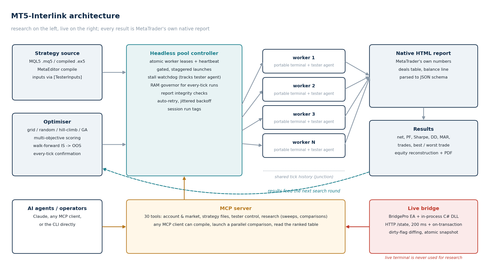
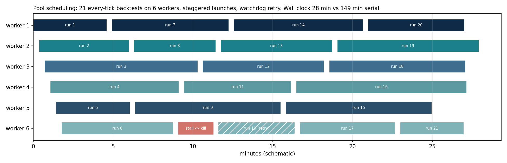
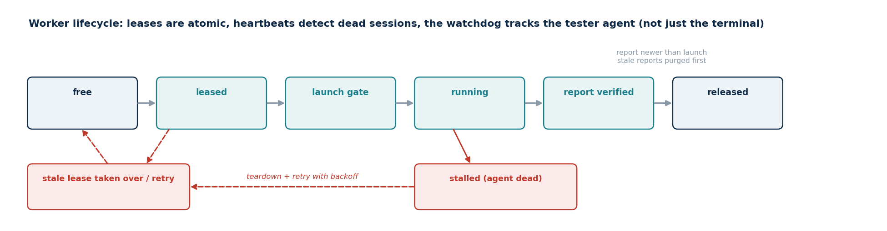
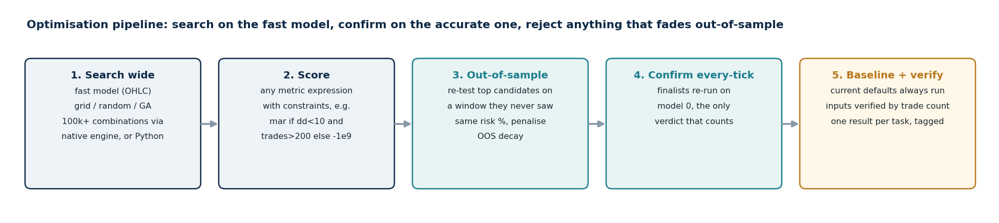

# MT5-Interlink

  

**A parallel, headless backtest and optimisation engine for MetaTrader 5, with an MCP server that lets AI agents drive it.**

MetaTrader's Strategy Tester produces the most faithful simulation available for MQL5 strategies, but it is single-threaded, GUI-bound and awkward to script. MT5-Interlink turns it into a research service: a pool of portable, headless terminals runs many backtests at once, every result is MetaTrader's own native report parsed to a fixed schema, and the whole system is exposed to any MCP client as tools. No strategy source changes are required; any compiled `.ex5` runs as is.



Pairs with [overfit-detector](https://github.com/CyberTraderX/overfit-detector), which takes the reports this engine produces and scores them for selection bias and fragility before anything is called validated.

---

## Contents

1. [Parallel headless pool](#1-parallel-headless-pool)
2. [Built for many agents on one machine](#2-built-for-many-agents-on-one-machine)
3. [Optimisation](#3-optimisation)
4. [MCP server](#4-mcp-server)
5. [Live bridge](#5-live-bridge)
6. [Quick start](#6-quick-start)
7. [Design rules the engine enforces](#7-design-rules-the-engine-enforces)
8. [Layout and requirements](#8-layout-and-requirements)

---

## 1. Parallel headless pool

`headless_pool.py`

- **One portable terminal per CPU lane.** Workers live at `C:\MT5_Headless`, `C:\MT5_Headless_2`, ... and share tick history through a filesystem junction, so N strategies or N parameter sets backtest simultaneously. The live trading terminal is never used for research.
- **Native reports as ground truth.** Each run yields MetaTrader's own HTML report, parsed into a JSON schema: net, profit factor, Sharpe, max drawdown, MAR, trade count, win rate, best and worst trade. No re-implemented metrics, no OnTester hooks.
- **Every-tick, OHLC or open-price models** selectable per run. Every-tick (model 0) is treated as the only trustworthy verdict; the faster models are for screening.
- **Equity reconstruction.** The report carries only the balance line. `equity_curve.py` rebuilds the true equity series from the deal list against price bars and renders it, with optional PDF export.



The timeline is a schematic of the scheduler's behaviour: staggered launches so tester agents do not race for the same local port, work assigned to whichever worker frees first, and a stalled run torn down and retried rather than blocking until the timeout.

## 2. Built for many agents on one machine

The pool was hardened for the case where several AI sessions share one workstation and launch runs independently of each other.



- **Atomic worker leases** with heartbeat and stale-lease takeover. Two sessions can never claim the same terminal.
- **Gated, staggered launches** to prevent port contention between tester agents.
- **Stall watchdog.** A terminal can linger alive but idle after its `metatester64` agent dies under memory pressure. The pool tracks the agent process, not just the terminal, tears the run down after a configurable idle window and retries.
- **Zombie cleanup** on demand and automatically whenever no free worker is found.
- **Report integrity.** Stale reports are purged before launch, a locked stale report refuses to run, and any report older than the launch timestamp is rejected. One task can never be handed another task's result.
- **Memory governor.** A semaphore caps concurrent every-tick runs machine-wide, since each agent grows to several GB of tick history. Tunable via `MT5_EVERYTICK_MAX`.
- **Run tags.** Every result JSON and filename carries a session tag, so each agent pulls only its own results from the shared results folder.
- **Auto-retry with jittered backoff** on no-report and agent-port-bind failures.

## 3. Optimisation

`optimizer.py`, `optimize.py`



Two engines, one discipline: search wide on the fast model, confirm the finalists every-tick, and reject anything that fades out-of-sample.

- **Native engine.** One in-process MT5 optimisation (genetic or complete) over the full space, read from MT5's official all-passes XML. Handles 100k+ combinations.
- **Python engine.** The search runs in Python over the parallel pool with one native report per candidate. Strategies: grid, random, coordinate hill-climb, genetic (tournament selection, crossover, mutation).
- **Multi-objective scoring.** Rank on any expression of the metrics, with constraints. Example: `mar if dd<10 and trades>200 else -1e9`.
- **Walk-forward validation.** Score in-sample, re-test the top candidates on an out-of-sample window they never saw at the same risk, and penalise configurations whose OOS performance decays. The current defaults are always run as a baseline.
- **Parameter injection** through the tester's `[TesterInputs]` section, verified by trade count so a silently ignored input cannot pass as a result.

## 4. MCP server

`mcp/server.py`

Exposes MetaTrader 5 to any MCP client as 30 tools over two channels: the MetaTrader5 Python package for read-only account and market data, and the in-process HTTP bridge for tester automation and live pushed state.

| Group | Tools |
|---|---|
| Account and market | `mt5_account`, `mt5_state`, `mt5_positions`, `mt5_orders`, `mt5_symbols`, `mt5_tick`, `mt5_rates`, `mt5_deals`, `mt5_history`, `mt5_portfolio_exposure` |
| Strategy files | `mt5_compile`, `mt5_list_strategies`, `mt5_read_strategy`, `mt5_write_strategy` |
| Strategy Tester | `mt5_tester_configure`, `mt5_tester_smart_configure`, `mt5_tester_run`, `mt5_tester_status`, `mt5_tester_stop`, `mt5_tester_read_settings` |
| Research | `mt5_bt_results`, `mt5_compare_run`, `mt5_quick_compare`, `mt5_sweep`, `mt5_headless_compare` |

An agent can compile a strategy, launch a parallel comparison across symbols, read back the ranked table and decide the next experiment without a human touching the terminal.

## 5. Live bridge

`BridgePro.mq5` and `MT5Bridge.cs`

An in-process C# HTTP bridge loaded as a DLL by a lightweight EA. It pushes account, position, order and terminal state on a 200 ms timer and instantly on every trade transaction, with dirty-flag diffing so unchanged state costs nothing. A single `/state` endpoint returns everything atomically. Full RFC 8259 JSON escaping and correct 64-bit ticket encoding.

## 6. Quick start

```powershell
# compare several strategies on one symbol, every-tick, ranked by profit factor
python headless_pool.py --period H1 --from 2020.01.01 --to 2025.12.31 --model 0 `
    --symbol NDX100 --expert StrategyA.ex5 --expert StrategyB.ex5 --sort pf --tag session1

# walk-forward optimisation with an OOS split and every-tick confirmation of the top 5
python optimizer.py --ea StrategyA.ex5 --symbol NDX100 --period H1 `
    --from 2021.01.01 --to 2026.06.01 `
    --param InpVolMultiplier=1.0:1.4:0.1 --param InpRiskPercent=0.30:0.55:0.01 `
    --objective "mar if dd<10 and trades>200 else -1e9" `
    --search genetic --oos-split 2024.09.01 --confirm-top 5

# pool health
python headless_pool.py --status
```

Setup for a new machine, including worker creation and MCP registration, is in [SETUP_NEW_MACHINE.md](SETUP_NEW_MACHINE.md). All machine identity (terminal ID, login, paths) lives in `interlink_config.py` and is overridable by environment variables; nothing else hardcodes a path.

## 7. Design rules the engine enforces

- Every-tick is the only verdict that counts. OHLC and open-price runs are for screening.
- In-sample and out-of-sample are tested at the same risk. A configuration that wins in-sample and fades out-of-sample is a curve fit, not an edge.
- Inputs are verified by effect (trade count), never assumed.
- One result per task, provably from that task.
- Nothing is called validated on the basis of a backtest alone. Reports go through [overfit-detector](https://github.com/CyberTraderX/overfit-detector) with an honest trial count before any allocation decision.

## 8. Layout and requirements

```
headless_pool.py      parallel pool: leases, launch gate, watchdog, retries, export
headless_runner.py    single-worker runner + native report parser
optimizer.py          native + Python optimisation engines, multi-objective, walk-forward
optimize.py           simpler IS/OOS grid optimiser
equity_curve.py       equity reconstruction + chart/PDF rendering
interlink_config.py   single source of truth for paths, terminal, login (env-overridable)
dev_cycle.py          rebuild DLL, compile EA, redeploy (stops MT5)
mcp/server.py         MCP server (FastMCP)
BridgePro.mq5         bridge EA
MT5Bridge.cs/.csproj  in-process HTTP bridge (.NET, win-x64)
docs/make_figures.py  regenerates every figure in this README
```

Windows, MetaTrader 5, Python 3.12+ with `MetaTrader5` and `fastmcp`, .NET SDK for the bridge. Portable MT5 copies for the workers.

## Licence

MIT. Not affiliated with MetaQuotes.
